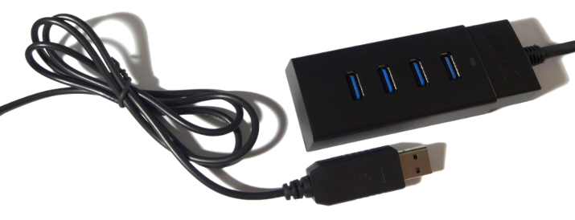

# io-usb

Nim bindings for libusb, the cross-platform user library to access USB devices.

## About

io-usb contains binding to libusb for the [Nim](http://nim-lang.org) programming
language. libusb provides generic access to USB devices. It is portable,
requires no special privileges or elevation and supports all versions of the
USB protocol.

## Supported Platforms

io-usb is still under development and does not work yet. So far, the
following platforms have been built and tested:

- ~~Android~~
- ~~FreeBSD~~
- ~~iOS~~
- ~~Linux~~
- ~~Mac OSX~~
- ~~OpenBSD~~
- ~~Windows~~

## Prerequisites

To compile the bindings in this package you must have **libusb** installed on
your computer.

### Android

TODO

### FreeBSD

TODO

### iOS

TODO

### Linux

If you are using Linux then libusb is most likely already installed on your
computer. If your Linux distribution includes a package manager or community
repository, it likely also has the latest pre-compiled binaries for libusb.

For example, on ArchLinux you can get the library from the package manager:

`sudo pacman -Sy libusb`

Alternatively, you can download the latest source code from the libusb GitHub
repository and compile the library yourself.

### Mac OSX

TODO

### OpenBSD

TODO

### Windows

TODO

## Dependencies

io-usb does not have any dependencies to other Nim packages at this time.

## Usage

## Support

Please [file an issue](https://github.com/nimious/io-usb/issues), submit a
[pull request](https://github.com/nimious/io-usb/pulls?q=is%3Aopen+is%3Apr)
or email us at info@nimio.us if this package is out of date or contains bugs.
For all other issues related to Oculus devices or the device driver software
visit the Oculus web sites below.

## References

- [libusb Homepage](http://libusb.info/)
- [libusb GitHub Repository](https://github.com/libusb/libusb)
